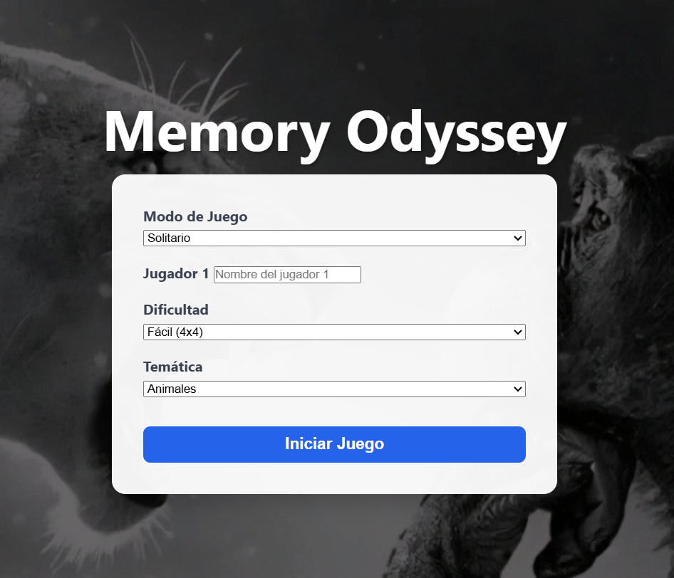
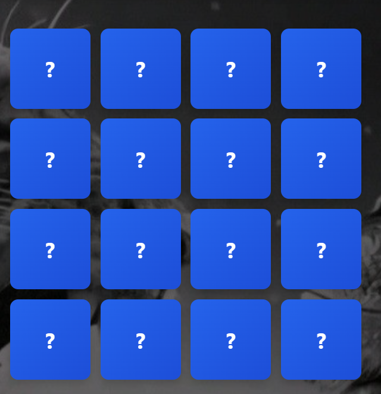
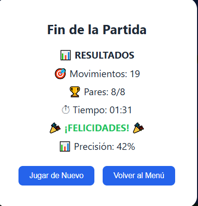

# Memory Odyssey

## Descripción

Memory Odyssey es un juego de memoria web donde el jugador debe encontrar pares iguales volteando cartas. El juego ofrece modos de juego en solitario, PvP local y modo libre.

## Integrantes y división del trabajo

- **Integrante 1:** Mariangel Campos
  - Diseño de la interfaz y estructura HTML.
  - Lógica de selección de modo de juego y cambios de fondo.
- **Integrante 2:** Adrian Monroy
  - Programación de la lógica del tablero, validación de pares y temporizador.
  - Implementación de logros y pantalla final.

## Instrucciones para ejecutar el proyecto

1. Descarga o copia el proyecto en una carpeta local.
2. Abre el archivo `index.html` directamente en un navegador moderno.

## Temáticas implementadas

- `animals` - Animales
- `food` - Comida
- `transport` - Transporte

## Logros implementados

- **Primer Par**
  - Desbloquea al encontrar el primer par.
- **Racha Caliente**
  - Desbloquea al lograr 3 pares consecutivos.
- **Sin Titubeos**
  - Desbloquea al encontrar un par en el primer movimiento.
- **Velocista**
  - Desbloquea al completar el modo difícil (8x8) en 30 segundos o menos.

## Capturas de pantalla

## Archivos principales

- `index.html` - Interfaz principal del juego.
- `css/style.css` - Estilos generales.
- `css/menu.css` - Estilos del menú.
- `css/board.css` - Estilos del tablero y cartas.
- `css/animations.css` - Animaciones.
- `js/themes.js` - Temáticas y emojis.
- `js/game.js` - Lógica principal del juego.
- `js/achieviements.js` - Sistema de logros.
- `js/modal.js` - Resultados y modal final.
- `js/state.js` - Estado del juego y configuración.
